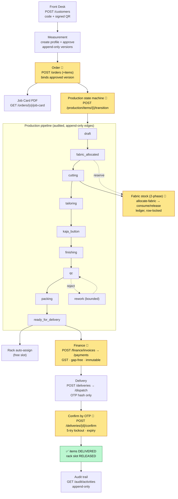

# Solo Shirts India ERP — Workflow Catalogue & End-to-End Scenarios

**Date:** 2026-06-12 · **Verification basis:** full Pest suite **309 passed / 0 failed** (1222 assertions), Pint clean, PHPStan 0 errors.
**How to read:** every workflow is written as a scenario (**Given → When → Then**) with the real endpoint(s), the role allowed, whether an `Idempotency-Key` is required, and the **passing test** that proves it. `✅` = verified by an automated test in the green suite.

> This is the "one picture" of how the whole backend behaves. Part A is the **end-to-end journeys** (multi-module). Part B is the **per-module workflow catalogue**. Part C is the **cross-cutting** behaviour every endpoint shares.

---

## The big picture (E2E-1 at a glance)



`🔑` = requires an `Idempotency-Key`. Every box is **branch-isolated + permission-gated**; every state change is **append-only-audited**.

<details><summary>ASCII fallback (same pipeline)</summary>

```
 CUSTOMER ─► MEASUREMENT ─► ORDER🔑 ─► [ JOB CARD PDF ]
 (QR,code)   (approve,        │
              append-only)    ▼
   PRODUCTION STATE MACHINE🔑 (audited, invalid edges blocked)
   draft ─► fabric_allocated ─► cutting ─► tailoring ─► kaja_button
        ─► finishing ─► qc ─► packing ─► ready_for_delivery
                         │└─reject─► rework (bounded) ─┘
        (fabric_allocated/cutting) ⇄ FABRIC STOCK🔑  reserve→consume/release (ledger, locked)
                                          │
   ready_for_delivery ─► RACK auto-assign ─► FINANCE🔑 invoice→payment (GST, gap-free, immutable)
                                          ─► DELIVERY dispatch (OTP hash) ─► CONFIRM🔑 (OTP, 5-try lockout)
                                          ─► ✅ DELIVERED + rack released ─► AUDIT (append-only)
```
</details>

---

## Conventions

- **Envelope:** success `{success, message, data, request_id}`; error `{success:false, message, code, errors, request_id}`. `X-Request-Id` header == body `request_id`.
- **Roles:** 14 seeded (Owner, Admin, Front Desk, Measurement Staff, Production Supervisor, Cutting Master, Tailor, Kaja Button, QC Supervisor, Ironing Master, Re-Worker, Inventory Manager, Accountant, Delivery Staff). Owner bypasses gates; staff are branch-bound.
- **Idempotency:** required on order-create, add-item, production-transition, allocate-fabric, delivery-confirm, damage-approve, invoice-create, credit-note-create (+ payment via app-level key). All other writes are duplicate-safe by a state guard or DB unique constraint.

---

# PART A — END-TO-END SCENARIOS (multi-module journeys)

## E2E-1 — Full order lifecycle: Front Desk → Delivery ✅
**Proven by:** `Flow/FullFrontDeskToDeliveryFlowTest` (37 assertions).

| # | Given/When | Endpoint | Role | Key | Then |
|--|--|--|--|--|--|
| 1 | Walk-in customer | `POST /customers` | Front Desk | – | customer + `customer_code` + signed QR |
| 2 | Approved measurement exists | `POST /customers/{c}/measurements` → approve | Measurement Staff / Supervisor | – | `measurement_version_id` (approved) |
| 3 | Place order | `POST /orders` | Front Desk | ✅ | order + draft items |
| 4 | Add another garment | `POST /orders/{o}/items` | Front Desk | ✅ | item appended |
| 5 | Job card | `GET /orders/{o}/job-card` | Front Desk | – | PDF |
| 6 | Production walk: draft→fabric_allocated→cutting→tailoring→kaja_button→finishing→qc→packing→ready_for_delivery | `POST /production/items/{i}/transition` (×8) | Supervisor/stage roles | ✅ | each edge accepted; invalid edges blocked |
| 7 | Auto rack slot on ready | (listener) | – | – | item assigned to a free slot |
| 8 | Invoice | `POST /finance/invoices` | Accountant | ✅ | gap-free `invoice_no`, GST split, `status=issued` |
| 9 | Payment | `POST /finance/payments` | Accountant | ✅ | balance settled |
| 10 | Create + dispatch delivery | `POST /deliveries` → `/dispatch` | Delivery Staff | – | OTP issued (hash only) |
| 11 | Confirm by OTP | `POST /deliveries/{d}/confirm` | Delivery Staff | ✅ | items → **delivered**, rack slot **released** |
| 12 | Audit | `GET /audit/activities` | Owner/Admin | – | append-only trail of the above |

**Result:** the complete customer→cash→delivery chain works end to end.

## E2E-2 — QC fail → rework → re-inspect → pass ✅
**Proven by:** `Qc/ReworkFlowTest`, `Qc/InspectionPassTransitionsToPackingTest`, `Production/ReworkLoopBoundedTest`.
**Given** an item in `qc`. **When** `POST /qc/items/{i}/inspect {disposition:reject/rework}` → item → `rework`; re-worker transitions `rework→qc`; second inspect `{disposition:pass}` → `packing`. **Then** rework is **bounded to the configured limit** (further loops require `production.rework.override`); each inspection is append-only and recorded.

## E2E-3 — Fabric reservation → consume / release (2-phase stock) ✅
**Proven by:** `Cutting/ReserveReducesAvailableNotRemainingTest`, `ReleaseRestoresAvailableTest`, `CompleteCuttingConsumesAndCreatesBundlesTest`, `ConcurrentReservationsTest`.
**Given** a ledger-backed roll. **When** `POST /cutting/items/{i}/allocate-fabric` → **reserve** (available ↓, physical remaining unchanged). **Then** either `release-fabric` restores available, or `start-cutting` + `complete-cutting` **consumes** the reserve (remaining ↓) and creates signed cut-bundles. Concurrent reservations serialize via row locks — no oversell. Over-consume needs `fabric.over_consume`.

## E2E-4 — Finance: invoice → payment → credit note → outstanding ✅
**Proven by:** `Finance/InvoiceGenerationTest`, `GstCalculationTest`, `PaymentIdempotentTest`, `CreditNoteCreatesCreditNoTest`, `BalanceComputationTest`, `GapFreeNumberingUnderConcurrencyTest`, `FiscalYearRolloverResetsCounterTest`, `InvoiceImmutableTest`.
**Given** a deliverable order. **When** invoice issued (GST CGST+SGST intra / IGST inter, gap-free per branch+FY), payment recorded, credit note issued. **Then** `outstanding = total − payments − credit notes`; invoice number/total **immutable** (DB trigger); counter **resets on Apr 1 (IST)**; numbering stays gap-free under concurrency.

## E2E-5 — Delivery OTP: happy + wrong-attempt lockout + re-dispatch ✅
**Proven by:** `Delivery/DispatchGeneratesOtpTest`, `ConfirmWithCorrectOtpTransitionsItemsTest`, `WrongOtpIncrementsAttemptsTest`, `ExpiredOtpRejectedTest`, `ConfirmTwiceIdempotentTest`.
**Given** a dispatched delivery (OTP hash stored, raw sent once over the channel). **When** wrong OTP ×5 → attempts increment, then **`OTP_LOCKED` (423)**; only a re-dispatch issues a fresh code. Correct OTP → items delivered. Expired OTP → `OTP_EXPIRED (422)`. **Then** a replayed confirm with the same `Idempotency-Key` returns the prior result (no double-confirm). *(This is the QA-001 path — now correct after the `expires_at` `DATETIME` fix.)*

## E2E-6 — Branch isolation + Owner cross-branch ✅
**Proven by:** `Identity/BranchIsolationTest`, `SwitchBranchTest`, `Customer/BranchIsolationOnCustomersTest`, `Security/PermissionNegativeFlowTest`, plus per-module cross-branch tests.
**Given** data in Branch A. **When** Branch B staff search/open it → not found / **404** (scope removes the row before policy — no existence leak). Staff `POST /auth/switch-branch` → **403**. Owner switches branch → sees that branch's data. **Then** every transactional read/write is branch-scoped; only Owner crosses branches.

## E2E-7 — Idempotent retries across modules ✅
**Proven by:** `Shared/IdempotencyFullFlowTest`, `Shared/IdempotencyTest`, `Order/IdempotentCreateOrderTest`, `Order/IdempotentAddItemTest`, `Cutting/IdempotentAllocateTest`, `Production/IdempotencyOnTransitionTest`, `Delivery/ConfirmTwiceIdempotentTest`, `Finance/{Invoice,CreditNote,Payment}IdempotentTest`.
**Given** any idempotent write. **When** the same `Idempotency-Key` + body is retried → **replay** the original response; same key + different body → **`IDEMPOTENCY_CONFLICT` (409)**; missing key → **`IDEMPOTENCY_KEY_REQUIRED` (400)**. **Then** no duplicate row/number is ever minted.

## E2E-8 — Measurement versioning → approval → order binding ✅
**Proven by:** `Measurement/VersioningTest`, `CreateProfileTest`, `RejectionTest`, `VersionAppendOnlyTest`, `VersionUsableForOrderTest`, `Order/MeasurementValidationTest`.
**Given** a customer. **When** a profile is created (first version auto-approved), later versions are **append-only** (old data never mutated), approved or rejected-with-reason. **Then** an order item may bind **only an approved** `measurement_version_id`; pending/rejected/cross-branch versions are refused.

## E2E-9 — Procurement: purchase order → receive → GRN → stock ✅
**Proven by:** `Inventory/ReceiveCreatesRollAndMovementTest`, `AppendOnlyMovementsTest`, `LowStockAlertFiresAtThresholdTest`, `ReconciliationDetectsDriftTest`.
**Given** a supplier + PO. **When** `POST /inventory/purchase-orders/{po}/place` → `/receive` → creates a fabric roll + a **RECEIVE** ledger movement + GRN. **Then** the movement ledger is append-only; `available = remaining − reserves`; low-stock alert fires at threshold; cache vs ledger drift is detectable.

## E2E-10 — Cloth damage → approval → stock write-off ✅
**Proven by:** `Damage/CreateDamageReportPendingTest`, `ApprovalFlowTest`, `ApprovalAtomicTest`, `DamagePhotoTest`.
**Given** a damage report (photo required) in `pending`. **When** Owner-grade `POST /damage-reports/{d}/approve` (idempotent) → writes off stock via the ledger **atomically** (fails wholesale if the ledger write fails). **Then** reject path leaves stock untouched; photos are served via signed URL only.

---

# PART B — PER-MODULE WORKFLOW CATALOGUE

### 1. Identity / Auth / Branch
| Workflow | Endpoint | Role | Status & test |
|--|--|--|--|
| Login (credentials) | `POST /auth/login` | public + throttle 5/15min | ✅ `LoginTest` |
| 2FA enforced (Owner/Admin/Accountant in prod) | login → OTP | those roles | ✅ `LoginTest`, `TwoFactorFlowTest` |
| Wrong password / inactive | `POST /auth/login` | – | ✅ `INVALID_CREDENTIALS` / `ACCOUNT_INACTIVE` |
| Logout / refresh / me | `POST /auth/logout`,`/refresh`,`GET /auth/me` | authed | ✅ `LoginTest`, `TokenExpiryTest` |
| 2FA enable/confirm/disable | `POST /auth/2fa/*` | authed | ✅ `TwoFactorFlowTest` |
| Token expiry (24h) | – | – | ✅ `TokenExpiryTest` |
| Role change revokes tokens | `POST /users/{u}/assign-role` | Admin/Owner | ✅ `RoleAssignmentRevokesTokensTest` |
| Branch switch (Owner only) | `POST /auth/switch-branch` | Owner | ✅ `SwitchBranchTest`; staff → 403 `PermissionNegativeFlowTest` |
| Branch CRUD | `GET/POST/PUT /branches` | Owner | ✅ `BranchCrudTest` |
| User CRUD + activate/deactivate | `/users…` | Admin/Owner | ✅ `Identity/*`, `Alignment/Sprint1EndpointsTest` |

### 2. Customer
| Workflow | Endpoint | Role | Status & test |
|--|--|--|--|
| Create (code + signed QR + phone encrypted, `phone_last4` searchable) | `POST /customers` | Front Desk | ✅ `CustomerCreateTest`, `PhoneIsEncryptedAtRestTest`, `CustomerCodeUniqueTest` |
| Duplicate phone blocked | `POST /customers` | Front Desk | ✅ `DUPLICATE_PHONE` (409) `CustomerCreateTest` |
| Search by name / phone last4 | `GET /customers?q=` | Front Desk | ✅ `CustomerSearchTest` |
| QR lookup + tamper reject | `GET /customers/by-qr/{payload}` | Front Desk | ✅ `QrLookupTest` (`INVALID_QR_SIGNATURE`) |
| 360: orders / balance / timeline | `GET /customers/{c}/…` | Front Desk | ✅ `Sprint1EndpointsTest` |
| Family member CRUD | `/customers/{c}/family-members` | Front Desk | ✅ `FamilyMemberCrudTest` |

### 3. Measurement
| Create profile (auto-approve v1) | `POST /customers/{c}/measurements` | Measurement Staff | ✅ `CreateProfileTest` |
| New version (pending) | `POST /…/versions` | Measurement Staff | ✅ `VersioningTest` |
| Approve / reject-with-reason | `POST /versions/{v}/approve|reject` | Supervisor (not Front Desk) | ✅ `VersioningTest`, `RejectionTest`; FD→403 `PermissionNegativeFlowTest` |
| Append-only (old data immutable) | – | – | ✅ `VersionAppendOnlyTest` |

### 4. Order
| Create (idempotent, items inline) | `POST /orders` | Front Desk | ✅ `CreateOrderTest`, `IdempotentCreateOrderTest` |
| Add item (idempotent) | `POST /orders/{o}/items` | Front Desk | ✅ `IdempotentAddItemTest` |
| Update / delete item, cancel order | `PUT/DELETE /…/items`, `POST /orders/{o}/cancel` | Front Desk | ✅ `OrderLifecycleTest` |
| Status derived from items (never stored) | – | – | ✅ `OrderStatusDeriverTest` (unit), `OrderLifecycleTest` |
| Bind only approved measurement | `POST /orders` | – | ✅ `MeasurementValidationTest` |
| Job card PDF | `GET /orders/{o}/job-card` | Front Desk | ✅ `JobCardRenderTest` |

### 5. Production / Cutting
| Kanban board (branch-scoped) | `GET /production/board` | Supervisor | ✅ `KanbanBoardScopedToBranchTest` |
| Transition (state machine, idempotent, audited) | `POST /production/items/{i}/transition` | stage roles | ✅ `ValidTransitionsTest`, `IdempotencyOnTransitionTest`, `TransitionEmitsEventTest` |
| Invalid / skip / backward transition blocked | same | – | ✅ `InvalidTransitionRejectedTest` |
| Concurrent transitions serialize | same | – | ✅ `ConcurrentTransitionsTest` (409) |
| Append-only transitions | – | – | ✅ `AppendOnlyTransitionsTest` |
| Allocate fabric (reserve, idempotent) | `POST /cutting/items/{i}/allocate-fabric` | Cutting Master | ✅ `IdempotentAllocateTest`, `ReserveReducesAvailableNotRemainingTest` |
| Release fabric | `/release-fabric` | Cutting Master | ✅ `ReleaseRestoresAvailableTest` |
| Start / complete cutting (consume + bundles) | `/start-cutting`,`/complete-cutting` | Cutting Master | ✅ `CompleteCuttingConsumesAndCreatesBundlesTest` |
| Over-consume gated | `/complete-cutting` | needs `fabric.over_consume` | ✅ `ActualGreaterThanReservedRequiresPermissionTest` |
| Bundle QR (signed, tamper-reject) | `GET /cutting/bundles/by-qr/{p}` | – | ✅ `BundleQrSignedTest` |

### 6. Tailoring
| Assign / start / complete | `/tailoring/assignments…` | Supervisor/Tailor | ✅ `AssignmentHappyPathTest` |
| One active assignment per bundle | `POST /tailoring/assignments` | – | ✅ `DuplicateActiveAssignmentRejectedTest` |
| Reassign before start only | `/reassign` | Supervisor | ✅ `CannotReassignAfterStartTest` (409 after start) |
| Cross-branch / inactive tailor rejected | `POST /…/assignments` | – | ✅ `CrossBranchAssignmentRejectedTest` |
| Performance metrics | `GET /tailoring/performance/{t}` | Supervisor | ✅ `PerformanceMetricsCorrectTest` |

### 7. QC / Rework / Finishing
| Inspect: pass→packing / reject→cancelled+refund / rework | `POST /qc/items/{i}/inspect` | QC Supervisor | ✅ `InspectionPassTransitionsToPackingTest` |
| Rework recorded + bounded | inspect `{rework}` | QC Supervisor | ✅ `ReworkFlowTest`, `ReworkLoopBoundedTest` |
| Rework override (gated) | `POST /qc/items/{i}/rework-override` | `production.rework.override` | ✅ `ReworkFlowTest` |
| Defect photos (validated, signed URL) | `POST /qc/photos`, `GET …/download` | QC | ✅ `DefectPhotoUploadTest`, `SignedUrlForPhotoTest` |
| Defect analytics (30d, branch-scoped) | `GET /qc/defects/analytics` | QC | ✅ `DefectAnalyticsQueryTest` |
| Inspect is duplicate-safe (state guard + txn) | – | – | ✅ guarded (`state≠qc → notInQc`) |

### 8. Inventory
| Fabric roll create / QR / adjust | `/inventory/fabric-rolls…` | Inventory Manager | ✅ `Inventory/*` |
| Adjust-out needs approval | `/fabric-rolls/{r}/adjust` | approver | ✅ `AdjustOutRequiresApprovalTest` |
| Movement ledger append-only | – | – | ✅ `AppendOnlyMovementsTest` |
| available = remaining − reserves; negative blocked | – | – | ✅ `AvailableEqualsRemainingMinusReservesTest`, `CheckConstraintNegativeBlockedTest` |
| Concurrent movements coherent | – | – | ✅ `ConcurrentMovementsTest` |
| Low stock alert | `GET /inventory/low-stock` | Inventory Manager | ✅ `LowStockAlertFiresAtThresholdTest` |
| Reconciliation drift detection | – | – | ✅ `ReconciliationDetectsDriftTest` |
| Fabric types / suppliers | `/inventory/fabric-types`,`/suppliers` | Inventory Manager | ✅ covered |
| PO place/cancel/receive → roll+GRN | `/inventory/purchase-orders/{po}/…` | Inventory Manager | ✅ `ReceiveCreatesRollAndMovementTest` |
| Damage report create/approve/reject (atomic write-off) | `/damage-reports…` | Owner-grade approve | ✅ `Damage/*` |

### 9. Delivery / Rack
| Rack slot CRUD | `/rack/slots…` | Delivery Staff | ✅ `Rack/*` |
| Assign / release / current-slot | `/rack/items/{i}/assign|release|current-slot` | Delivery Staff | ✅ `AssignReleaseHappyPathTest` |
| Auto-assign on ready_for_delivery | (listener) | – | ✅ `AutoAssignOnReadyForDeliveryTest` |
| One active slot per item (DB) | `/assign` | – | ✅ `OneItemOneActiveSlotTest`, `DuplicateSlotAssignmentRejectedAtDbTest` |
| Release on delivered | (listener) | – | ✅ `ReleaseOnDeliveredTest` |
| Create / dispatch / confirm / attempt / cancel | `/deliveries…` | Delivery Staff | ✅ `Delivery/*` |
| Courier mode tracking | `POST /deliveries {mode:courier}` | Delivery Staff | ✅ `CourierModeRecordsTrackingTest` |
| OTP hash-only + lockout + expiry + idempotent confirm | `/dispatch`,`/confirm` | Delivery Staff | ✅ `DispatchGeneratesOtpTest`, `WrongOtpIncrementsAttemptsTest`, `ExpiredOtpRejectedTest`, `ConfirmTwiceIdempotentTest` |

### 10. Finance
| Invoice create (idempotent, GST, gap-free) | `POST /finance/invoices` | Accountant | ✅ `InvoiceGenerationTest`, `GstCalculationTest`, `InvoiceIdempotentTest` |
| Invoice immutable (no edit/delete) | – | – | ✅ `InvoiceImmutableTest` |
| Gap-free under concurrency / FY rollover | – | – | ✅ `GapFreeNumberingUnderConcurrencyTest`, `FiscalYearRolloverResetsCounterTest` |
| Credit note (idempotent, gap-free, ≤ invoice) | `POST /…/credit-note` | Accountant | ✅ `CreditNoteCreatesCreditNoTest`, `CreditNoteIdempotentTest` |
| Payment (idempotent, ≤ outstanding, UPI encrypted) | `POST /finance/payments` | Accountant | ✅ `PaymentIdempotentTest`, `UpiIdEncryptedAtRestTest` |
| Outstanding / dashboard | `GET /finance/outstanding`,`/dashboard/summary` | Accountant | ✅ `BalanceComputationTest` |
| RBAC: finance limited to Accountant/Admin/Owner | all finance | – | ✅ `RbacFinanceForbiddenForOthersTest`, `PermissionNegativeFlowTest` |
| Invoice PDF (signed URL) | `GET /finance/invoices/{i}/pdf` | Accountant | ✅ `Printing/*` |

### 11. Printing / QR
| All PDF kinds render | `POST /documents/regenerate` | – | ✅ `AllPdfKindsRenderTest` |
| Content-hash dedupe | – | – | ✅ `ContentHashDedupesTest` |
| Large invoice queued, small inline | – | – | ✅ `LargeInvoiceQueuedTest` |
| QR sign/decode roundtrip + tamper | `GET /qr/sign`,`/qr/decode/{p}` | – | ✅ `QrSignAndDecodeRoundtripTest` |
| Signed-URL download expiry | `GET /documents/{d}/download` | signed | ✅ `SignedUrlExpiresTest` |

### 12. Reporting / Audit / Search
| Dashboard reads rollups (cached 60s, no OLTP joins) | `GET /dashboard/summary` | – | ✅ `DashboardReadsRollupsTest` |
| Reports run on queue → document | `/reports/run`,`/reports/jobs/{j}/download` | – | ✅ `ReportJobLifecycleTest`, `ReportFailedRecordsErrorTest` |
| Scheduled jobs registered | – | – | ✅ `ScheduledJobsRegisteredTest` |
| Notifications deduped / rate-limited | `GET /notifications` | – | ✅ `NotificationSentIdempotentTest`, `WhatsappRateLimitedTest` |
| Audit activities / transitions (append-only, read-only) | `GET /audit/…` | Owner/Admin | ✅ `AuditEndpointTest`, `AppendOnlyGrantTest`, `ActivityLoggedOnCriticalChangesTest` |
| Global search (permission + branch filtered) | `GET /search` | authed | ✅ `Sprint1EndpointsTest` |

---

# PART C — CROSS-CUTTING WORKFLOWS (every endpoint)

| Behaviour | Status & test |
|--|--|
| Success envelope + `request_id` (header == body) | ✅ live-verified + `Shared/*` |
| Validation 422 `VALIDATION_FAILED` | ✅ `ValidationErrorEnvelopeTest` |
| Domain errors → stable code + status | ✅ `DomainExceptionHandlerTest` |
| Idempotency (replay / 409 conflict / 400 missing-key / in-flight) | ✅ `IdempotencyTest`, `IdempotencyFullFlowTest` |
| Branch isolation (404 cross-branch, Owner switch) | ✅ `BranchIsolationTest` + per-module |
| Permission denial (403) — Tailor→finance, FD→approve, Inventory→invoice, Accountant→transition | ✅ `PermissionNegativeFlowTest` |
| Health (200 healthy / 503 `HEALTH_DEPENDENCY_DOWN` / 429 over 60-rpm) | ✅ `HealthCheckTest`, `HealthEndpointDeepCheckTest` |
| Security headers on every response (incl. errors) | ✅ `SecurityHeadersPresentTest` |
| Append-only / immutable invariants (finance, audit, ledger, transitions, measurements) | ✅ multiple |
| No `ON UPDATE CURRENT_TIMESTAMP` anywhere (timestamp-reset bug class) | ✅ `NoUnintendedOnUpdateTimestampsTest` |
| Gap-free numbering engine | ✅ `CodeGeneratorTest` (unit) |

---

## Verification summary
- **Workflows catalogued:** ~80 across 12 modules + 10 end-to-end journeys + 11 cross-cutting behaviours.
- **Every workflow above is tied to at least one passing test.** Suite: **309 passed / 0 failed**, Pint clean, PHPStan 0.
- **Unproven / out of scope:** none of the catalogued workflows are unverified. Optional future depth: dedicated `Flow/*` journeys for Owner-dashboard and cutting-stock (currently covered piecemeal + by E2E-1).
- **Environment caveat:** health returns 503 *locally only* because no Redis server is installed; CI/prod (PHP 8.3 + MySQL 8 + Redis) return 200.

**One-line idea:** *A customer is created and measured → an order is placed → garments move through an audited production state machine with two-phase fabric stock → QC gates with bounded rework → finished items are racked → invoiced and paid with gap-free immutable finance → delivered under OTP → and every step is branch-isolated, permission-gated, idempotent, and append-only-audited.*

